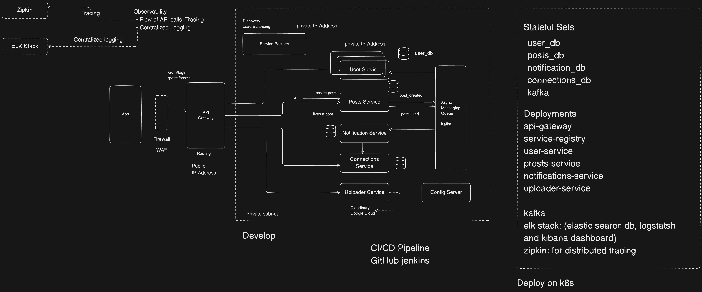
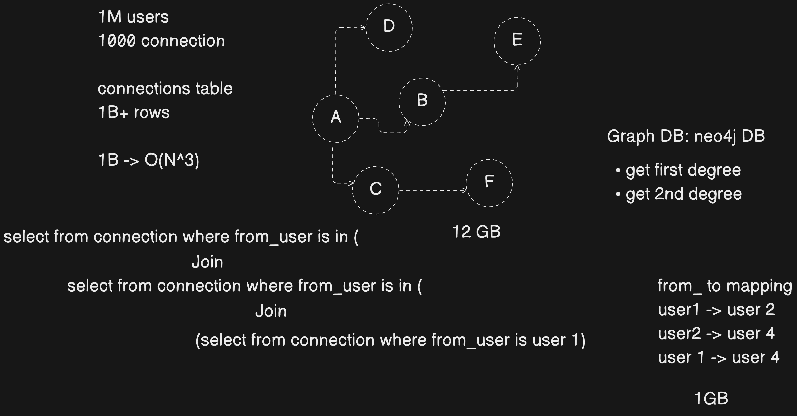

# OrbitNet

A LinkedIn-style professional social network, built as a set of Spring Boot microservices.

Users publish posts, like them, and build a connection graph; notifications fan out asynchronously over Kafka. The system is designed to be deployed on Kubernetes behind an API gateway.

- **Repository** — https://github.com/azammustafa66/orbit-net
- **Live demo** — [TODO]
- **API documentation (Swagger / OpenAPI)** — [TODO]
- **Postman collection** — [TODO]
- **Project board / roadmap** — [TODO]

---

## Architecture



**Request path.** Client traffic reaches a firewall / WAF, then the **API Gateway** — the only component with a public IP. The gateway handles routing (`/auth/login`, `/posts/create`, …), and validates the JWT once, forwarding the resolved user identity to downstream services. Everything behind it lives in a private subnet and is addressable only by private IP.

**Service discovery and config.** A **Service Registry** provides discovery and client-side load balancing so services address each other by name rather than by IP. A **Config Server** centralizes configuration across environments.

**Data ownership.** Every service owns its database — `user_db`, `posts_db`, `notification_db`, `connections_db`. No service reads another service's tables; cross-service reads go through APIs or events.

**Asynchronous messaging.** Posts Service emits `post_created` and `post_liked` events to **Kafka**. Notification Service consumes them and fans out notifications, so a like never blocks on notification delivery.

**Media.** Uploader Service pushes media to external object storage (Cloudinary / Google Cloud Storage) rather than storing binaries in a service database.

**Observability.** **Zipkin** for distributed tracing across API calls, **ELK** (Elasticsearch, Logstash, Kibana) for centralized logging.

**Delivery.** CI/CD through GitHub and Jenkins, deployed to Kubernetes:

| Kubernetes object | Workloads |
| --- | --- |
| **Deployments** | `api-gateway`, `service-registry`, `user-service`, `posts-service`, `notifications-service`, `uploader-service` |
| **StatefulSets** | `user_db`, `posts_db`, `notification_db`, `connections_db`, `kafka` |
| **Supporting** | ELK stack, Zipkin |

### Services

| Service | Port | Database | Status |
| --- | --- | --- | --- |
| posts-service | 8080 | `posts-service` | Implemented — posts CRUD, pagination, likes |
| user-service | 8081 | `user-service` | Scaffolded |
| api-gateway | — | — | Planned |
| service-registry | — | — | Planned |
| connections-service | — | `connections_db` (Neo4j) | Planned |
| notification-service | — | `notification_db` | Planned |
| uploader-service | — | — | Planned |
| config-server | — | — | Planned |

---

## Why a graph database for connections



Degrees of connection ("you and X share a connection") are the query that decides the storage engine.

**Relational shape.** At 1M users averaging 1,000 connections each, a `connections` table holds **1B+ rows** (~12 GB). First-degree lookups are a single indexed scan, but each additional degree requires another self-join against a billion-row table:

```sql
select from connection where from_user is in (
  join select from connection where from_user is in (
    join (select from connection where from_user is user1)))
```

Third-degree traversal approaches **O(N³)** — impractical at this size, and the cost grows with the *depth* of the question rather than the size of the answer.

**Graph shape.** Neo4j stores the same information as a `from → to` adjacency mapping (~1 GB) and traverses it natively:

```
user1 -> user2
user2 -> user4
user1 -> user4
```

First- and second-degree lookups become pointer traversals from a starting node, proportional to the neighbourhood actually visited rather than to the size of the table.

**Decision:** `connections-service` will use Neo4j; the other services stay on PostgreSQL, where relational integrity and transactions matter more than traversal depth.

---

## Tech stack

**In use:** Java 21 · Spring Boot 4.1.0 · Spring Web MVC · Spring Data JPA (Hibernate 7) · PostgreSQL 16 · Bean Validation (Hibernate Validator) · Lombok · ModelMapper · JJWT · Maven

**Planned:** Spring Cloud Gateway · Netflix Eureka / Spring Cloud Config · Apache Kafka · Neo4j · Zipkin · ELK · Docker · Kubernetes · Jenkins

---

## Getting started

### Prerequisites

- JDK 21
- Docker (for PostgreSQL)
- Maven wrapper (`./mvnw`, included per service)

### 1. Start PostgreSQL

```bash
docker run -d --name postgres_db \
  -e POSTGRES_USER=admin \
  -e POSTGRES_PASSWORD=admin \
  -p 5432:5432 \
  postgres:16
```

### 2. Create the per-service databases

```bash
docker exec postgres_db psql -U admin -d postgres -c 'create database "posts-service"'
docker exec postgres_db psql -U admin -d postgres -c 'create database "user-service"'
```

### 3. Configure

Each service reads `src/main/resources/application.properties`:

```properties
spring.datasource.url=jdbc:postgresql://localhost:5432/posts-service
spring.datasource.username=admin
spring.datasource.password=admin
spring.jpa.hibernate.ddl-auto=update
```

> Schema is currently managed by Hibernate `ddl-auto=update`. Flyway migrations are on the roadmap before any deployment that has to preserve data.

### 4. Run a service

```bash
cd posts-service
./mvnw spring-boot:run
```

The service starts on `http://localhost:8080` and creates its tables on first boot.

---

## API — posts-service

Base path: `/api/v1/core/posts`

Until the API gateway is in place, the caller's identity is read from an `X-User-Id` header (defaulting to `1`). The gateway will supply this header from a validated JWT.

| Method | Endpoint | Description |
| --- | --- | --- |
| `POST` | `/api/v1/core/posts` | Create a post |
| `GET` | `/api/v1/core/posts/{postId}` | Fetch a single post |
| `GET` | `/api/v1/core/posts/users/{userId}?page=1&size=10` | Page through a user's posts, newest first |
| `POST` | `/api/v1/core/posts/likes/{postId}` | Like a post |
| `DELETE` | `/api/v1/core/posts/likes/{postId}` | Remove a like |

### Create a post

```bash
curl -X POST localhost:8080/api/v1/core/posts \
  -H 'Content-Type: application/json' \
  -H 'X-User-Id: 7' \
  -d '{"content":"post to be liked"}'
```

```json
{
  "postId": 1,
  "userId": 7,
  "content": "post to be liked",
  "createdAt": "2026-08-15T18:58:07.461125",
  "updatedAt": "2026-08-15T18:58:07.461152"
}
```

### Page through a user's posts

Pages are **1-indexed**; `size` accepts 1–50.

```json
{
  "content": [ { "postId": 1, "userId": 7, "content": "…" } ],
  "page": 1,
  "size": 10,
  "totalElements": 1,
  "totalPages": 1,
  "hasNext": false
}
```

### Errors

All failures return a consistent envelope, with `fieldErrors` populated for validation failures:

```json
{
  "error": "Validation failed",
  "fieldErrors": { "content": "Post content must not be blank" },
  "statusCode": "400 BAD_REQUEST",
  "timestamp": "2026-08-15T14:48:11.442976"
}
```

| Status | Raised when |
| --- | --- |
| `400` | Blank/oversized content, out-of-range paging params, malformed path variables, duplicate like, unlike without a like |
| `404` | Post does not exist |
| `500` | Unexpected — logged server-side, generic message returned |

---

## Project layout

```
orbit-net/
├── docs/images/          architecture and design diagrams
├── posts-service/        posts, likes, feed pagination  (port 8080)
└── user-service/         accounts and auth             (port 8081)
```

---

## Roadmap

- [x] Posts service — create, fetch, paginate
- [x] Post likes with duplicate protection
- [x] Consistent error handling and request validation
- [ ] User service — registration, login, JWT issuance
- [ ] API gateway — routing and JWT validation
- [ ] Service registry and config server
- [ ] Connections service on Neo4j
- [ ] Kafka events (`post_created`, `post_liked`) and notification service
- [ ] Uploader service with external object storage
- [ ] Flyway migrations
- [ ] Zipkin tracing and ELK logging
- [ ] Dockerfiles, Kubernetes manifests, Jenkins pipeline

---

## Contributing

Contribution guidelines — [TODO]

## License

License — [TODO]

## Contact

Maintainer contact — [TODO]
